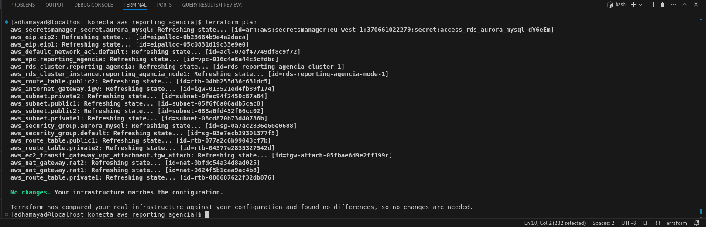
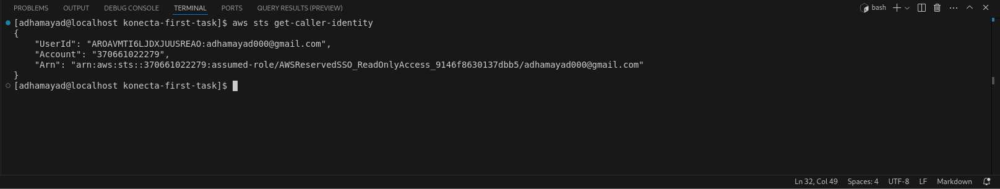

# Konecta Cloud Internship – Task 1

This task demonstrates the Terraform automation of AWS resources for the *first Cloud Computing internship task*:

- Full *Terraform automation*:
  - Import existing AWS resources
  - VPC & Subnets
  - S3 Buckets
- *AWS CLI* configured for account management
- Verify infrastructure with terraform plan

---

## Plan Result



---

## AWS Account Overview



---

## Infrastructure Overview

- **Network (network.tf): 1 VPC + 4 subnets  
- **Storage (storage.tf): 2 S3 buckets  
- **Compute (compute.tf): EC2 instances configuration  
- **Provider (provider.tf): AWS provider setup  
- **Backend (backend.tf): Terraform backend configuration  

---

## Project Structure

```bash
📁 assets
  ├─ account_details.png
  └─ No_changes.png
📁 modules
📄 backend.tf
📄 compute.tf
📄 main.tf
📄 network.tf
📄 provider.tf
📄 README.md
📄 storage.tf
📄 terraform.tfstate
📄 terraform.tfstate.backup
📄 terraform.tfvars
📄 variables.tf
