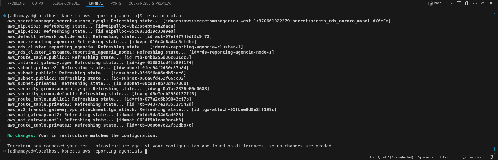

# Konecta AWS Reporting Agencia – Cloud Internship Task 1

This repository demonstrates **AWS infrastructure management using Terraform** for the first Cloud Computing internship task.  
The goal is to build an organized AWS environment with full documentation of resources, networks, storage, and account details, while facilitating infrastructure management using Terraform.

---

## Repository Contents

```bash
konecta_aws_reporting_agencia/
│
├─ assets/                     # Illustrative images of data and command outputs
│  ├─ no_changes.png            # Result of terraform plan (No changes)
│  └─ user_info.png             # Result of aws sts get-caller-identity
│
├─ compute.tf                   # Compute resources definition (EC2, AutoScaling, etc.)
├─ network.tf                   # Network configuration (VPC, Subnets, Security Groups)
├─ storage.tf                   # Storage resources definition
├─ provider.tf                  # AWS provider configuration
├─ backend.tf                   # Terraform backend configuration
├─ variables.tf                 # Terraform variables definitions
├─ terraform.tfvars             # Values for Terraform variables
├─ terraform.tfstate            # Current Terraform state
├─ terraform.tfstate.backup     # Backup of Terraform state
├─ main.tf                      # Main file linking resources and modules
├─ modules/                     # Reusable Terraform modules
├─ PlanResult                   # Result of terraform plan
├─ ResourcesByTerraform         # Output of AWS resources tagged Platform=Terraform
├─ ImportCommands               # Bash script for importing existing AWS resources
└─ README.md                    # This file
````

---

## File Description

* **compute.tf**: Configuration for compute resources such as EC2 and AutoScaling Groups.
* **network.tf**: Network setup including VPC, Subnets, and Security Groups.
* **storage.tf**: Storage resources configuration.
* **provider.tf**: AWS provider and region setup.
* **backend.tf**: Centralized Terraform state storage configuration.
* **variables.tf & terraform.tfvars**: Variable definitions and values for the project.
* **main.tf**: Links all resources and modules together.
* **modules/**: Reusable Terraform modules.
* **PlanResult**: Output of `terraform plan` stored for verification.
* **ResourcesByTerraform**: Output of AWS resources filtered with `Platform=Terraform` tag, generated with:

```bash
aws resourcegroupstaggingapi get-resources --tag-filters Key=Platform,Values=Terraform --output text > ResourcesByTerraform
```

* **ImportCommands: Bash script to import existing AWS resources into Terraform.

---

## Illustrative Images

### Terraform Plan – No Changes



### AWS Account Details


---

## Usage

1. **Initialize Terraform:**

```bash
terraform init
```

2. **Generate a list of existing AWS resources managed by Terraform:**

```bash
aws resourcegroupstaggingapi get-resources --tag-filters Key=Platform,Values=Terraform --output text > ResourcesByTerraform/resources.txt
```

3. **Import existing resources:**

```bash
./ImportCommands
```

4. **Check for changes:**

```bash
terraform plan
```

5. **Apply changes to the environment:**

```bash
terraform apply
```

---

## Notes

* All resources are created using Terraform to enable Infrastructure as Code (IaC).
* Files are organized by type (Compute, Network, Storage) for easier maintenance.
* All images are located in the `assets` folder to illustrate command results and account information.
* `ResourcesByTerraform/resources.txt` contains the current list of AWS resources managed by Terraform.

---

## Tools Used

* Terraform
* AWS CLI
* Bash scripting
* GitHub

---

## Infrastructure Overview

* **Network (network.tf):** VPC + Subnets + Security Groups
* **Compute (compute.tf):** EC2 Instances Configuration
* **Storage (storage.tf):** Storage resources configuration
* **Provider (provider.tf):** AWS Provider Setup
* **Backend (backend.tf):** Terraform Backend Configuration
